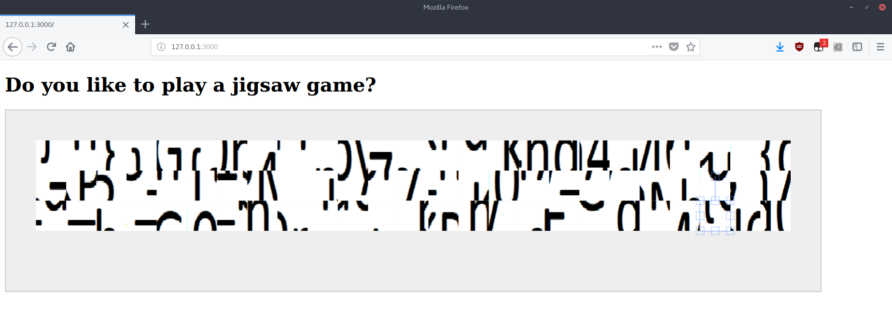
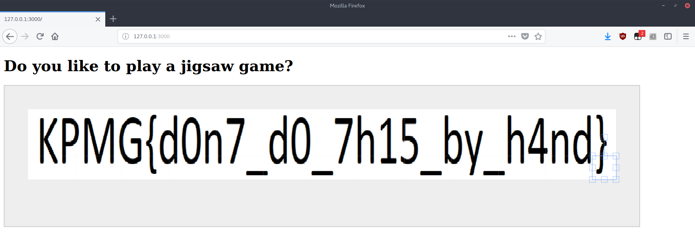

## Description :
```
E-society sends you a Jigsaw game. Just play a jigsaw game.
```

## File :
[Jigsaw.zip](Jigsaw.zip)


## Solution :

after extracting the Jigsaw archive, we will lay hold of a nodejs application

```zsh
# mkhdznfq @ ubuntu in ~/Desktop/kpmg/ACT 3/A Game of Jigsaw on git:master x [13:49:29] 
$ unzip -q Jigsaw.zip 

# mkhdznfq @ ubuntu in ~/Desktop/kpmg/ACT 3/A Game of Jigsaw/Jigsaw on git:master x [13:49:48] 
$ ls -l Jigsaw
total 32
drwxr-xr-x 47 mkhdznfq mkhdznfq  4096 Nov  1 16:14 node_modules
-rwxr-xr-x  1 mkhdznfq mkhdznfq   273 Nov  1 16:14 package.json
-rwxr-xr-x  1 mkhdznfq mkhdznfq 10370 Nov  1 16:14 package-lock.json
drwxr-xr-x  4 mkhdznfq mkhdznfq  4096 Nov  1 17:30 public
-rwxr-xr-x  1 mkhdznfq mkhdznfq   330 Nov  1 16:14 server.js
drwxr-xr-x  2 mkhdznfq mkhdznfq  4096 Nov  1 16:14 views
```

now let's run the the application

```zsh
# mkhdznfq @ ubuntu in ~/Desktop/kpmg/ACT 3/A Game of Jigsaw on git:master x [13:50:41] 
$ node Jigsaw/server.js 
It's on 3000 man
``` 



this is a pain to be done by hand. let's dive into the source code

```javascript
let canvas = new fabric.Canvas('canvas');

let list = Array.from({
    length: 75
}, (v, k) => k);
let shuffledList = list.sort(()=>{
    return .5 - Math.random();
});

let width = 25;
let height = 3;
let c = 0;
for (let h = 0; h < height; h++) {
    for (let w = 0; w < width; w++) {
        fabric.Image.fromURL(`/img/jig${shuffledList[c]}.png`, (img) =>{
            img.set({
                top: 50 + 50 * h,
                left: 50 + 50 * w,
                width: 50,
                height: 50    
            });
            canvas.add(img).renderAll().setActiveObject(img);
        });
        c++;
    }
}
```

the code above which reside in `index.ejs` are responsible for shuffling the jigsaw order. and if we view the `/img` folder, we can conclude that the images should be arranged in the following order

```
+-----+-----+-----+
|  i  | i+3 | ... |    
+-----+-----+-----+
| i+1 | ... | ... |
+-----+-----+-----+
| i+2 | ... | i+n |
+-----+-----+-----+
```

armed with that information, we can tamper the source code to make it render the images in the right order

```javascript
let canvas = new fabric.Canvas('canvas');

let width = 25;
let height = 3;
let c = 0;
for (let w = 0; w < width; w++) {
    for (let h = 0; h < height; h++) {
        fabric.Image.fromURL(`/img/jig${c}.png`, (img) =>{
            img.set({
                top: 50 + 50 * h,
                left: 50 + 50 * w,
                width: 50,
                height: 50    
            });
            canvas.add(img).renderAll().setActiveObject(img);
        });
        c++;
    }
}
```

now serve the file to obtain the flag

```zsh
# mkhdznfq @ ubuntu in ~/Desktop/kpmg/ACT 3/A Game of Jigsaw on git:master x [13:50:41] 
$ node Jigsaw/server.js 
It's on 3000 man
``` 

