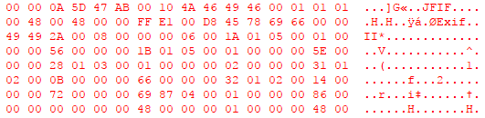
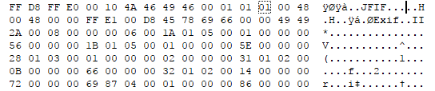

## Description :
```
The Syndicate found a dropped physical storage device from E-Society which might contain some sensitive information. Please help them to Investigate packet detail to find some evidence!
```

## File :
[BadThumb.zip](BadThumb.zip)


## Solution :
BadThumb.pcap is a usb capture packet of thumbdrive which consist several file that i manage to identify manually

- rufus.exe
- some JPG file
- some PNG file
- and text file

extract only the data

```bash
tshark -r BadThumb.pcap -Y "usb.capdata" -T fields -e usb.capdata > raw
```
remove the `:` and convert it to data from the hex number

```bash
xxd -r -p raw raw2.bin
```

the obvious one is the text file `S1BNR0N5YmVyQ2hhbGxlbmdl` which can decode to `KPMGCyberChallenge` which is not the flag.

i need to recover the flag manually because binwalk cant recover it properly

after some time, i come across the jpeg file with broken header



fixed the header



save and open the image will reveal the flag


Flag: `{KPMG_7h3_71m3_h45_c0m3}`