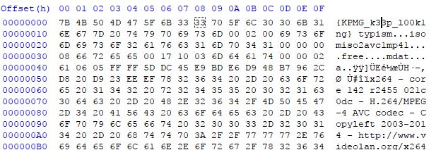
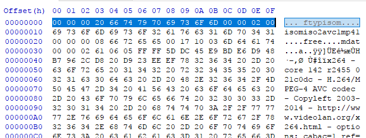

## Description :
```
The Syndicate picked up a thumb drive dropped by a suspected member of E-Society while on a VACATION. The thumb drive may potentially contain the secret hive of E-Society.

Do the necessary !!
```

## File :
[brenner-thumb.zip](brenner-thumb.zip)


## Solution :
Use binwalk to extract all the file

```bash
binwalk -e brenner-thumb.zip
```

and we found `vacation.mp4` but it cannot be played, so we chech the header we found the `{KPMG_k33p_l00k1ng}` so obviously not the flag, lets try fix the header file to the standard mp4 file





Add MsgBox to the `last` parameter to popup the flag

Play the video on 12 sec, we can see the flag


```
Flag: `{KPMG_b4ck707h3up51d3d0wn}`