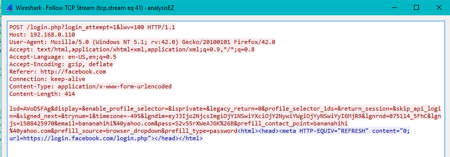
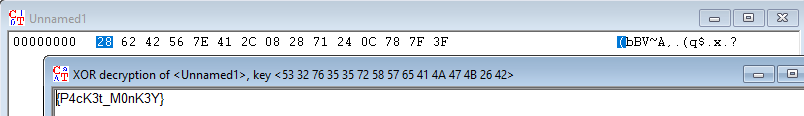

## Description :
```
Further investigation into the compromised leads you to a suspicious network traffic portion which seems to provide you with an encrypted file.

Find out whats in the file....

File: http://192.168.1.222:12812/2aa704a3893ca77496bfde8afe35e69d/analysisEZ.zip

Flag format: KPMG{xxxxxxxx}
```

## File :
[analysisEZ.zip](analysisEZ.zip)


## Solution :
Extract the zip we get 2 file, which is `analysisEZ.pcapng` and `flag.zip`. flag.zip needs password to extract, lest dive into the pcap file



we got some facebook password `pass=S2v55rXWeAJGK&B` use that password to extract the `flagrox` file, inside it we can found hexadecimal strings

`4b504d47286242567e412c082871240c787f3f`

which convert to 

`KPMG(bBV~A,.(q$.x.?`

looks encrypted, let try xor it with the password before but stripped the `KPMG`



So we got the flag: `KPMG{P4cK3t_M0nK3Y}`
