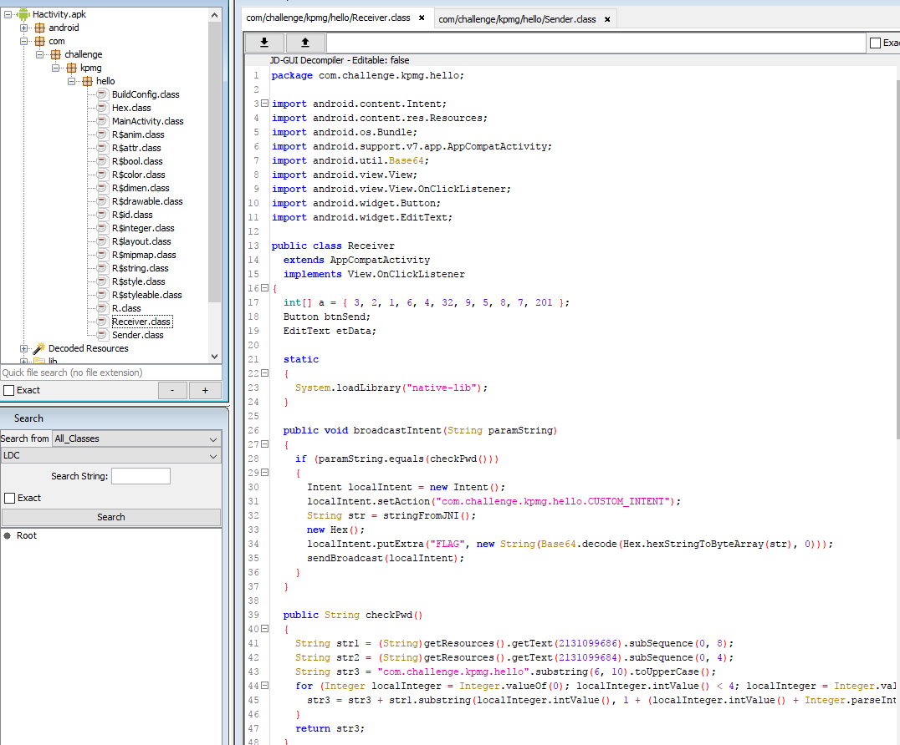
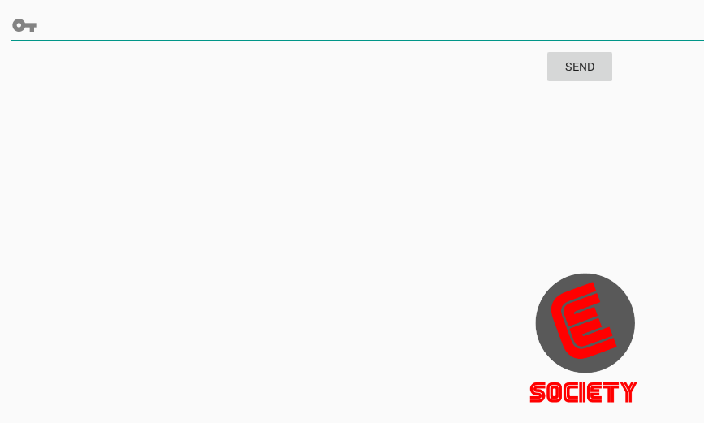
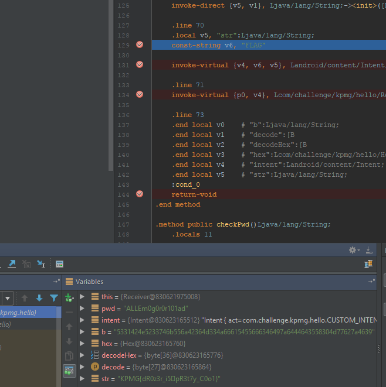

## Description :
```
A hidden message was sent to Ms. GG by E-Society. Find the hidden message.
The hidden message may lead you to the FINALS.

File: http://192.168.1.222:12812/e17e5142dfe0051e2773a621402eaaca/Hactivity.apk

Flag format: KPMG{xxxxxxxxxx}
```

## File :
[Hactivity.apk](Hactivity.apk)


## Solution :
This app needs a special extras as key to unlock the login page because if you open the app, it will shows the splash screen only


First things to do is decompile the apk and check what does it need to open the login page



So all checks is happening in the `Receiver.class`, lets try with adb shell to open directly the class `Receiver`

because I have problem with my adb connection to emulator, I directly run the commnad below on terminal emulator on the emulator itself. make sure to run as root

```bash
am start -n com.challenge.kpmg.hello/.Receiver
```

you will get the login page like below



The things is, the app will net let us send any password to debug because we didn't open it with the right keys, lets check whats key it needs in the decompile class.

below is the converted java code to retrieve key and password

```java
import java.util.*;
import java.lang.*;
import java.io.*;

class Ideone
{
	public static void main (String[] args) throws java.lang.Exception
	{
		int[] a = { 3, 2, 1, 6, 4, 32, 9, 5, 8, 7, 201 };
		String moria = "m0r1a_is_inverted_from_mario";
		String gg = "g00d_g4m3_w3ll_pl4y";
		String mobile = "IPhone 5s";
				  
		String str1a = (String) moria.subSequence(0, 8);
		String str2a = (String)gg.subSequence(0, 4);
		String str3a = "com.challenge.kpmg.hello".substring(6, 10).toUpperCase();
		for (Integer localInteger = Integer.valueOf(0); localInteger.intValue() < 4; localInteger = Integer.valueOf(1 + localInteger.intValue())) {
			str3a = str3a + str1a.substring(localInteger.intValue(), 1 + (localInteger.intValue() + Integer.parseInt("1.0".substring(0, 1)))) + str2a.substring(localInteger.intValue(), 1 + (localInteger.intValue() + Integer.parseInt("1.0".substring(2))));
		}
  
		String str1 = -2 + (a[1] + a[6] - a[7]) + (String) mobile.substring(7, 9);
		String str2 = (String) gg.substring(7, 9) + (String) mobile.substring(1, 2);
		String str3 = a[0] + "" + a[1];
		String key = 4 + a[10] - a[6] * (a[1] * a[1]) - Integer.parseInt(str3) + str2 + str1;
		
		System.out.println(key);
		System.out.println(str3a);
	}
}
```
and we get

key : 137m3P45s
password : ALLEm0g0r0r101ad


lets pass the command to the terminal with added key

```bash
am start -n com.challenge.kpmg.hello/.Receiver -e key 137m3P45s
```

add the password that we receive earlier and click send, make sure you set breakpoint at appriopriate place like below, and eventually you will get the flag



btw thw flag has some weird character in it, which actual from hex->base64->ascii

```
53 31 42 4E 52 33 74 6B 55 6A 42 36 4D 33 4A 66 61 54 55 66 63 46 49 7A 64 44 64 35 58 30 4D 77 62 7A 46 39
```

which translate to `S1BNR3tkUjB6M3JfaTUfcFIzdDd5X0MwbzF9` and decode again to get the flag.

Flag: `KPMG{dR0z3r_i5pR3t7y_C0o1}` or `KPMG{dR0z3r_i5_pR3t7y_C0o1}`

to debug using smali and android studio, you can use this great tool called `smalidea` from [here!](https://github.com/JesusFreke/smali/wiki/smalidea)