This is very nice Challenge on final KPMG top 3 malaysia vs top 3 thailand
unlucky for my team, we didnt get through till the end, stuck at the questions number 3
but overall it were a very fun and interesting challenge! and i learn a new things on this challenge. kudos to All KPMG cyber security Challenge Crew!

So the game is like this, the questions consist of a flag for current question with a file/IP for a next level, Im wrapping my head around about how the game is really work on the beginning of the game. After some explanation from the crew, I understand how the game works.

The first file is a pcap file, you need to find the flag in `KPMG[MD5]` format, the funnny thing is, I found the question for the next level instead of the flag for first level, and going very deep in the 2nd level question, so we getting a long time to find the first flag which is in the pcap file

The flag can be found in the ICMP packet to 192.168.10.141, it is a base 64 encoded flag, decode it and you got the flag `KPMG[6d56284759d9c66c96f36f6891e07e1c]`

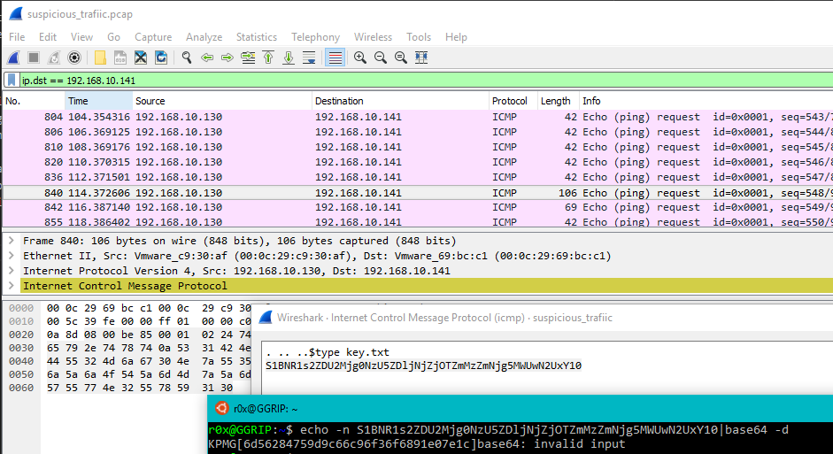

Also in the pcap file we can found an archive file for the next level which shown like below

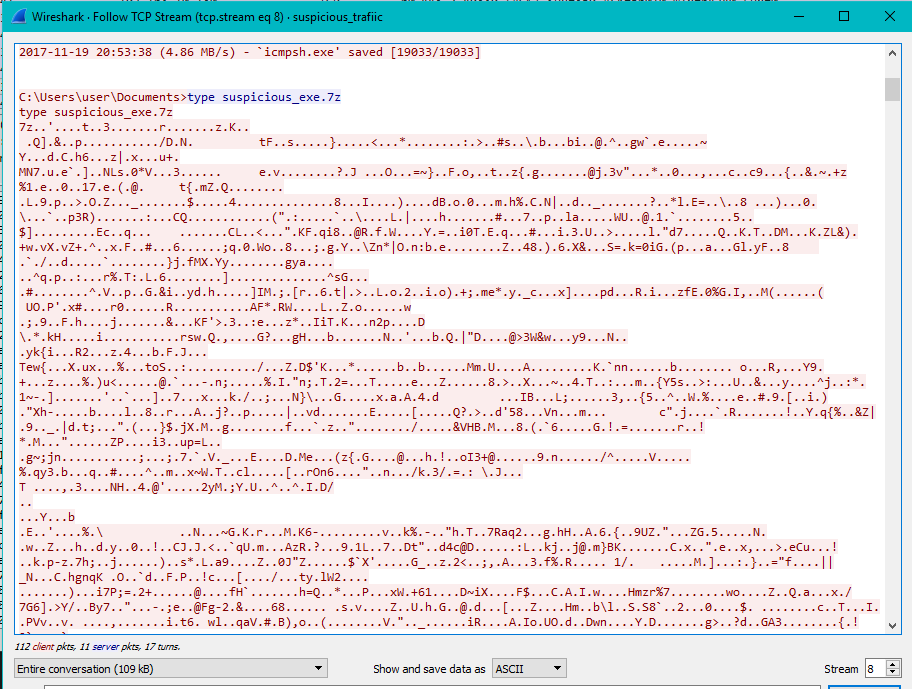

extract that file and you got you second file `suspicious_exe.7z` extracted file `suspicious_exe.exe` is a stub for fileless malware.

my first analysis found out it using custom base64 and normal base64 to encode its data for the powershell script, which later run the fileless malware. The interesting parts is, they didnt make it looks easy as it say, there a some rabbit hole to make you lose your way. lol

you can get all the encoded base64 strings and custom alphabets using `strings` tool!

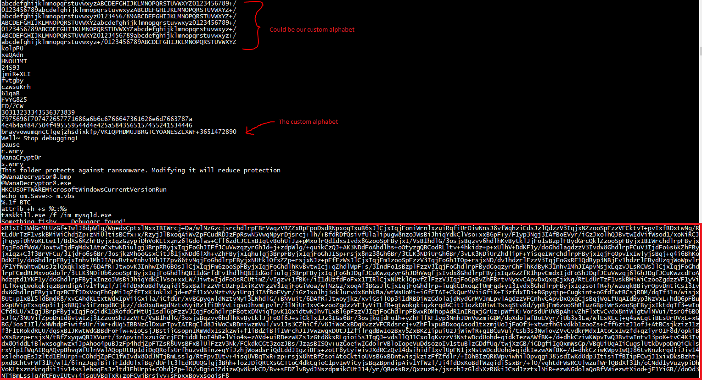

Decode it using custom base64 and normal base64:

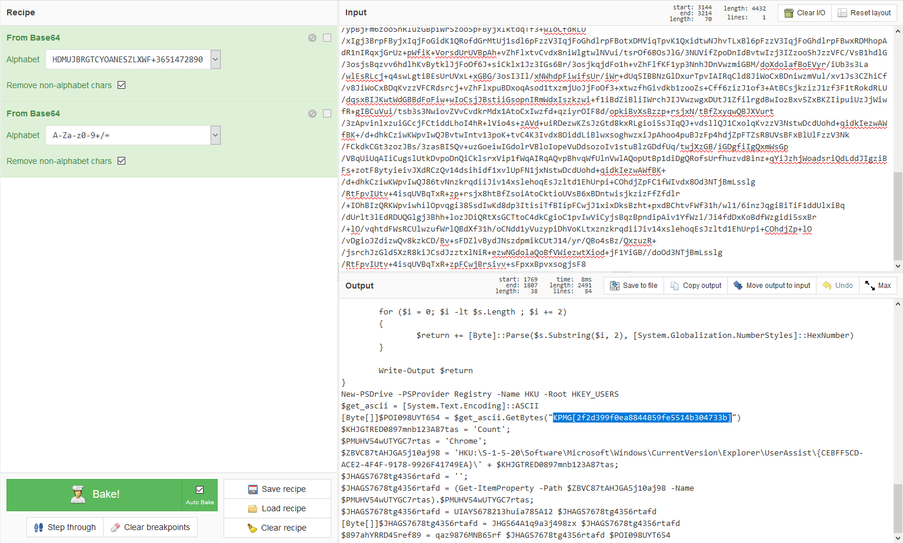

And you got powershell script!

```powershell
function qaz9876MNB65rf {
	param(
    	[Byte[]]$data_,
    	[Byte[]]$NBM876DFS432
  	)
 
	[Byte[]]$675GHF432mnb = New-Object Byte[] $data_.Length
	$data_.CopyTo($675GHF432mnb, 0)
	
	[Byte[]]$s = New-Object Byte[] 256;
    [Byte[]]$k = New-Object Byte[] 256;
 
    for ($i = 0; $i -lt 256; $i++)
    {
        $s[$i] = [Byte]$i;
        $k[$i] = $NBM876DFS432[$i % $NBM876DFS432.Length];
    }
 
    $j = 0;
    for ($i = 0; $i -lt 256; $i++)
    {
        $j = ($j + $s[$i] + $k[$i]) % 256;
        $temp = $s[$i];
        $s[$i] = $s[$j];
        $s[$j] = $temp;
    }
 
    $i = $j = 0;
    for ($x = 0; $x -lt $675GHF432mnb.Length; $x++)
    {
        $i = ($i + 1) % 256;
        $j = ($j + $s[$i]) % 256;
        $temp = $s[$i];
        $s[$i] = $s[$j];
        $s[$j] = $temp;
        [int]$t = ($s[$i] + $s[$j]) % 256;
        $675GHF432mnb[$x] = $675GHF432mnb[$x] -bxor $s[$t];
    }
 
	return $675GHF432mnb
}

function UIAYS678213huia785A12 {
	param(
    [Parameter(
        Position=0, 
        Mandatory=$true, 
        ValueFromPipeline=$true)
	]
	[Byte[]]$Bin)
	# assume pipeline input if we don't have an array (surely there must be a better way)
	if ($bin.Length -eq 1) {$bin = @($input)}
	$return = -join ($Bin |  foreach { "{0:X2}" -f $_ })
	Write-Output $return
}

function JHG564A1q9a3j498zx {
	param(
    [Parameter(
        Position=0, 
        Mandatory=$true, 
        ValueFromPipeline=$true)
	]	
	[string]$s)
	$return = @()
	
	for ($i = 0; $i -lt $s.Length ; $i += 2)
	{
		$return += [Byte]::Parse($s.Substring($i, 2), [System.Globalization.NumberStyles]::HexNumber)
	}
	
	Write-Output $return
}
New-PSDrive -PSProvider Registry -Name HKU -Root HKEY_USERS
$get_ascii = [System.Text.Encoding]::ASCII
[Byte[]]$POI098UYT654 = $get_ascii.GetBytes("KPMG[2f2d399f0ea8844859fe5514b304733b]")
$KHJGTRED0897mnb123A87tas = 'Count'; 
$PMUHV54wUTYGC7rtas = 'Chrome';
$ZBVC87tAHJGA5j10aj98 = 'HKU:\S-1-5-20\Software\Microsoft\Windows\CurrentVersion\Explorer\UserAssist\{CEBFF5CD-ACE2-4F4F-9178-9926F41749EA}\' + $KHJGTRED0897mnb123A87tas;
$JHAGS7678tg4356rtafd = '';
$JHAGS7678tg4356rtafd = (Get-ItemProperty -Path $ZBVC87tAHJGA5j10aj98 -Name $PMUHV54wUTYGC7rtas).$PMUHV54wUTYGC7rtas;
$JHAGS7678tg4356rtafd = UIAYS678213huia785A12 $JHAGS7678tg4356rtafd
[Byte[]]$JHAGS7678tg4356rtafd = JHG564A1q9a3j498zx $JHAGS7678tg4356rtafd
$897ahYRRD45ref89 = qaz9876MNB65rf $JHAGS7678tg4356rtafd $POI098UYT654
```
This script will get data from registry `HKU:\S-1-5-20\Software\Microsoft\Windows\CurrentVersion\Explorer\UserAssist\{CEBFF5CD-ACE2-4F4F-9178-9926F41749EA}\Count` with name `Chrome`

Registry data is RC4 encrypted data and you can see the flag for level 2 `KPMG[2f2d399f0ea8844859fe5514b304733b]`

This flag is use as RC4 key to encrypt and decrypt the data.

Running the binary, it will write all those encrypted value into the registry key but theres more to it, the binary itself have 2 encrypted data in it! If you just run the binary, you will get the 1st data only, for my analysis, I need to patch the jump to the second data and let it run.

going to registry key, we can see two registry Name called `Chrome` & `firefox`

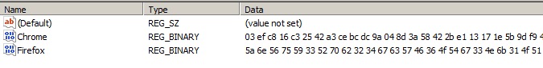

When running the powershell with added `Write-Output` to show the output of `$897ahYRRD45ref89`, I noticed some `55 55` on the output. so you need to convert from decimal 2 times, and will get a PE header.

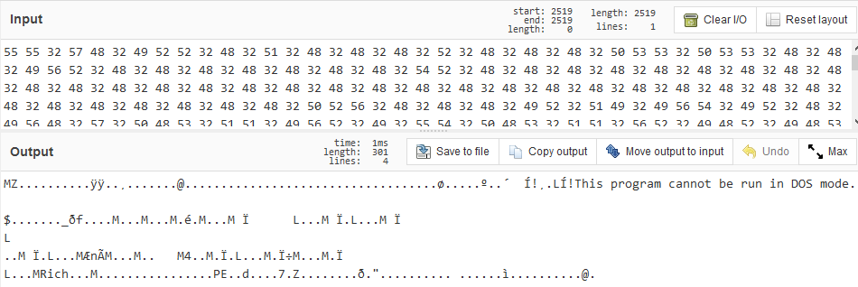

Lets convert it all to file by adding this line to our powershell code

`[io.file]::WriteAllBytes('file2.txt',$897ahYRRD45ref89)`

so we get PE files, run it will get

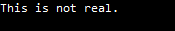

so obviously not the IP for the next level

Lets dive into the suspicious_exe.exe and find the IP address for the next level, this binary is annoying than I thought, I should bypass this questions on that day.

The binary itself is full with antidebug, grab yourself some anti-antidebug like ScyllaHide, then you good to go, but in my case, my plugin doesn't works as intended, so i manually patch the antidebug.

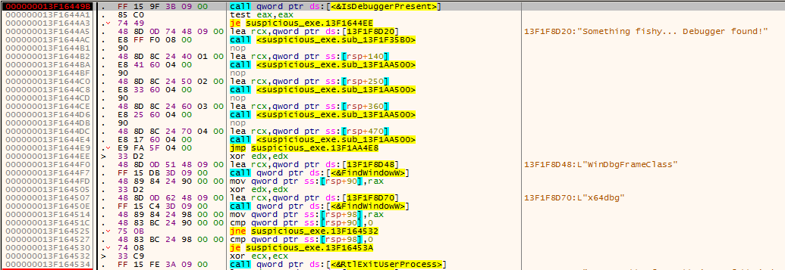

And I patch the code to jump directly ro the second data

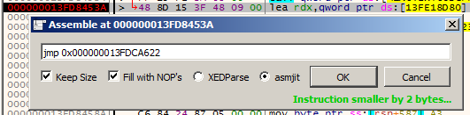

and run the binary and our new data will be written into the registry

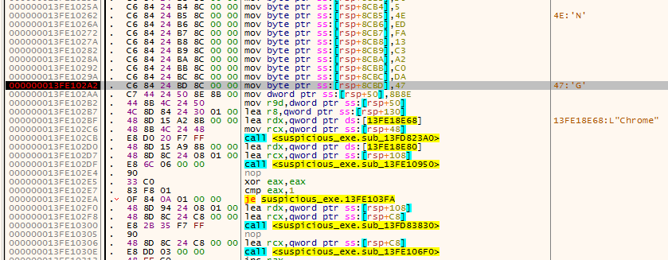

`Chrome` wil have our real PE for next questions while `firefox` will have base64 of powershell above

decrypt and run the new PE will get our IP for the next questions

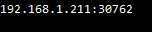

This writeup finished here because i didn't get a chance to try the next questions on that day.
