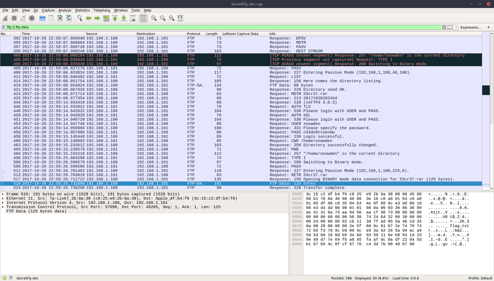

## File :
[SecretFly.zip](SecretFly.zip)

## Solution :

extract the given zip file to get an encrypted pcap. first we need to obtain the  WPA key using `aircrack-ng` (need wordlist) a

```zsh
# mkhdznfq @ ubuntu in ~/Desktop/SecretFly [20:28:43] 
$ aircrack-ng SecretFly.cap -w ~/arsenal/rockyou.txt
Opening SecretFly.cap
Read 9225 packets.

   #  BSSID              ESSID                     Encryption

   1  D8:5D:4C:C2:76:48  Test-Challenge            WPA (1 handshake)

Choosing first network as target.

Opening SecretFly.cap
Reading packets, please wait...
```


next we gonna run the pcap through `airdecap-ng` to obtain the decrypted packets

```zsh
# mkhdznfq @ ubuntu in ~/Desktop/SecretFly [20:36:25] 
$ airdecap-ng -p 1q2w3e4r5t6y -e Test-Challenge SecretFly.cap
Total number of packets read          9225
Total number of WEP data packets         0
Total number of WPA data packets       750
Number of plaintext data packets         0
Number of decrypted WEP  packets         0
Number of corrupted WEP  packets         0
Number of decrypted WPA  packets       596
```

browsing through the decrypted packets (`SecretFly-dec.cap`), we will come across FTP protocol transmitting a rar archive



let's extract it from the packet and try to unarchive it

```zsh
# mkhdznfq @ ubuntu in ~/Desktop/SecretFly [21:16:53] 
$ tshark -r SecretFly-dec.cap -qz follow,tcp,raw,5 | tail -n +7 | sed 's/^\s\+//g' | xxd -r -p > 53cr37.rar

# mkhdznfq @ ubuntu in ~/Desktop/SecretFly [21:17:50] 
$ unrar x 53cr37.rar 

UNRAR 5.30 beta 2 freeware      Copyright (c) 1993-2015 Alexander Roshal

53cr37.rar is not RAR archive
No files to extract
```

looks like the file is corrupted. upon further inspection, it seems like the magic header of rar archive was tampered with. so let's fix it and try again

```zsh
# mkhdznfq @ ubuntu in ~/Desktop/SecretFly [21:24:08] 
$ printf '\x52\x61\x72\x21\x1A\x07\x00' | dd of=53cr37.rar bs=1 seek=0 count=7 conv=notrunc              
7+0 records in
7+0 records out
7 bytes copied, 0.000236736 s, 29.6 kB/s

# mkhdznfq @ ubuntu in ~/Desktop/SecretFly [21:25:06] 
$ unrar x 53cr37.rar 

UNRAR 5.30 beta 2 freeware      Copyright (c) 1993-2015 Alexander Roshal


Extracting from 53cr37.rar

Enter password (will not be echoed) for ._flag.txt:
```

it need a password! by using the previous FTP password we recovered (`n33dn0ttokn0w`), we can successfully extract the archive and cat the flag from `._flag.txt`

```zsh
# mkhdznfq @ ubuntu in ~/Desktop/SecretFly [21:28:25] C:3
$ unrar x 53cr37.rar

UNRAR 5.30 beta 2 freeware      Copyright (c) 1993-2015 Alexander Roshal


Extracting from 53cr37.rar

Enter password (will not be echoed) for ._flag.txt: 

Extracting  ._flag.txt                                                OK 
All OK

# mkhdznfq @ ubuntu in ~/Desktop/SecretFly [21:28:29] 
$ cat ._flag.txt 
{KPMG_y0u_ju57_d1d_17_l37'5_m0v3_0n}
```