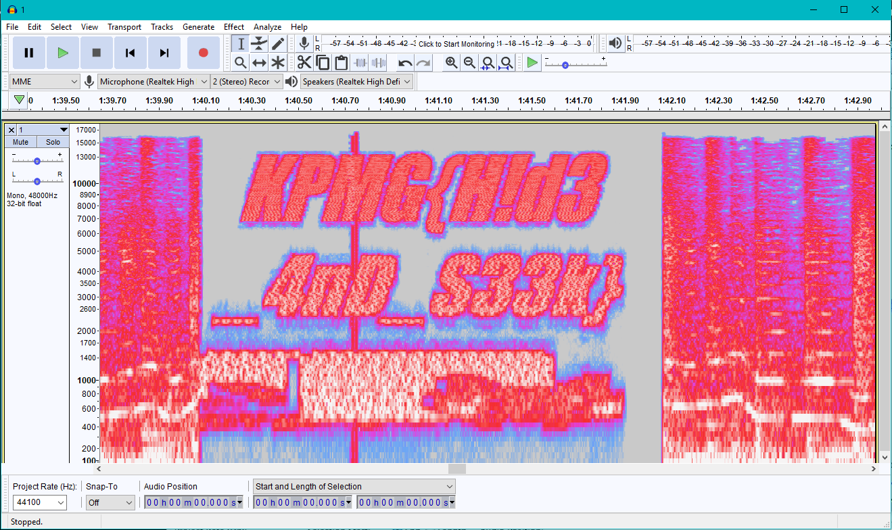

This challenge we couldn't solve during the challenge, but managed to get the flag after that.

## Description :
```
As your team investigate deeper in to E-Society, your team received an e-mail from an unknown sender with an attachment.

Your team proceed to conduct an investigation on the attachment.
```

## File :
[spectrum.zip](spectrum.zip)


## Solution :

`!.docx` is actually a mp3 file with added header of `NyanNyanNyan....` fix that and open with audacity at 1:40 minutes you can get the flag by view it with spectrum.




Got the flag! KPMG{H!d3_4nD_S33k}
