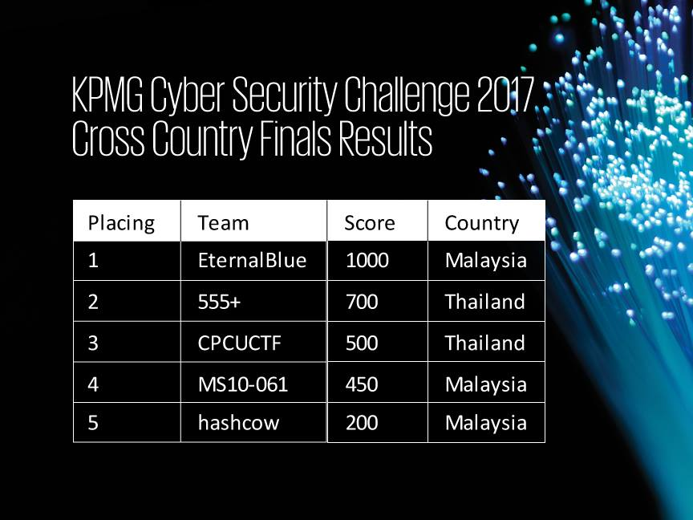
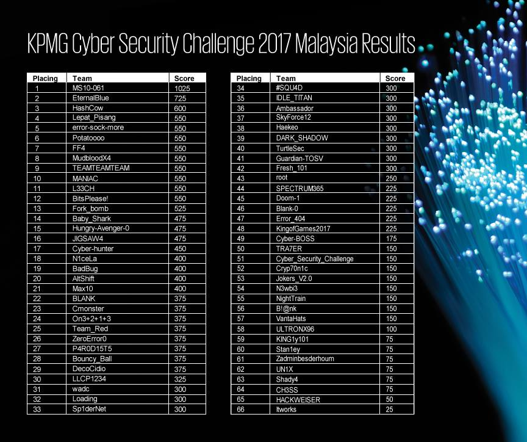

# KPMG Cyber Security Challenge 2017 Writeup

**Date:** 21 November 2017

**Category:** Jeopardy

**Description:**

The KPMG Cyber Security Challenge is back for the third consecutive year! Participants will be put to the test on their cyber security skills and knowledge in reverse engineering, steganography, cryptography, programming, network analysis, infrastructure hacking, web application security, and digital forensics.

As an added twist this year, KPMG Cyber Security Challenge is going to run both in Thailand and Malaysia, with the finalist from each country coming against each other for the finals and the Champions of the KPMG Cyber Security Challenge will be crowned!

This year, the Cyber Security Challenge is open to 62 teams (each team comprises of four members) where the competition’s objectives are to test the participant’s technical, analytical and creative thinking skills in solving cyber security challenge as well as to apply what they have learned in their studies in the real world.

This provides a great opportunity and platform for the participants to feel what it is like being a cyber security professional.

The Top 3 teams from Malaysia will be competing with the Top 2 teams from Thailand in the cross country final.In addition to that, we are also searching for the Best Female Team in this Challenge.

**Available Writeup**

- [CipherFromHell](CipherFromHell/)
- [how many stars in the sky](ACT 4/how many stars in the sky/)
- [Click Game APK](ACT 4/click game apk/)
- [Sonic](ACT 4/sonic/)
- [Noahs Ark](Noahs Ark/)
- [Tiny Thumb](ACT 4/tiny thumb/)
- [Analysis EZ](ACT 4/anal ez/)
- [SecretFly](SecretFly/)

**Not Available**
- All except above

This Writeup is brought to you by Alejnd Alliance 
